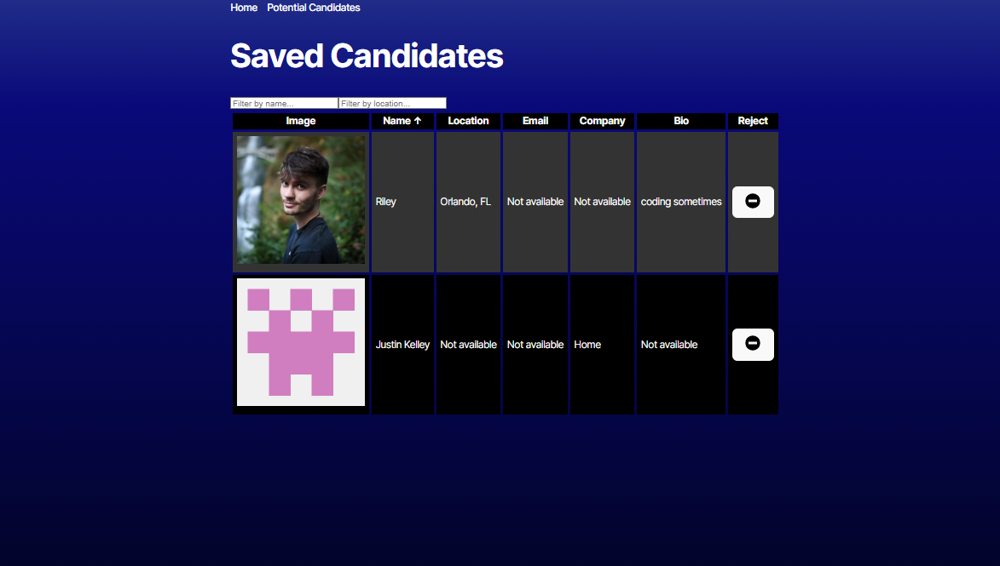

# Candidate Search Application

A React-based application for searching and managing potential job candidates from GitHub. Built with React, TypeScript, and Tailwind CSS.

## Live Demo
Visit the live application: [Candidate Search](https://candidatesearch-vajk.onrender.com/)

## Features

- **GitHub User Search**: Search for potential candidates using GitHub's API
- **Candidate Management**: Save and manage potential candidates
- **Sortable Grid**: Sort candidates by various fields
- **Filtering**: Filter candidates by name and location
- **Responsive Design**: Works on desktop and mobile devices

## Technology Stack

- React 18
- TypeScript
- Tailwind CSS
- React Router
- React Icons
- Local Storage for data persistence

## Getting Started

1. Clone the repository
2. Install dependencies:
```bash
npm install
```
3. Start the development server:
```bash
npm run dev
```

## Usage

### Search for Candidates
- Enter a GitHub username in the search field
- View detailed profile information
- Click "Save" to add to your candidate list

### Manage Saved Candidates
- View all saved candidates in a sortable grid
- Click column headers to sort by different fields
- Filter candidates by name or location
- Remove candidates with the delete button
- Click profile images to view GitHub profiles

## Features in Detail

### Sorting
- Click any column header to sort ascending/descending
- Visual indicators show current sort direction
- Case-insensitive sorting

### Filtering
- Real-time filtering as you type
- Case-insensitive matching
- Combines name and location filters

### Data Persistence
- Candidates are saved to local storage
- Data persists between browser sessions
- Confirmation dialog before removing candidates

## Screenshots
**Candidate Search**


**Saved Candidates**



